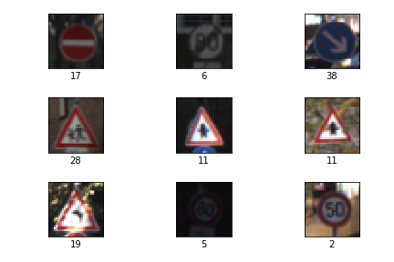
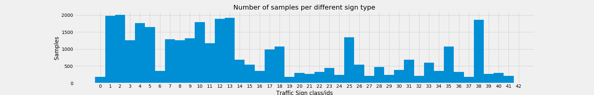

# Convolutional Neural Networks for Traffic Sign Classification
## Galen Ballew, 2017
---

This repository contains the code and data necessary to train a CNN to classify 43 different categories of traffic signs. I wrote an article about the process on [Medium](https://medium.com/@galen.ballew/).

---
### The Data

The training data for this project comes from the [German Traffic Sign Dataset](http://benchmark.ini.rub.de/?section=gtsrb&subsection=dataset). The notebook will automatically fetch this data and it is not directly included in the repository.  

<figure>

<figcaption>Fig1. - Example traffic signs.</figcaption>
</figure>

  

The images are **32x32** and depict one of **43** different classes of signs. The images come split into **34,799** training images and **12,630** test images. There is some class imbalance. The training/validation split is stratified to help with this.

<figure>

<figcaption>Fig2. - Distribution of sign classes.</figcaption>
</figure>

  

---
### Preprocessing
This network is aimed at simplicity. As such, the only preprocessing involved is the normalization of pixel values to a range **[0,1]**.

---
### Architecture
The architecture used in this CNN is extremely similar to Yann LeCunn's original LeNet architecture. A difference between the original LeNet architecture from 1989 and the one provided is that a max pooling function has been applied rather than Yann LeCun's original subsampling function.

In addition, two additional functions/parameters to the network to help combat overfitting. The first is a dropout layer (thanks Professor Hinton!). Dropout applies a Bernoulli distribution to activations (i.e. the values being passed) during the feed-forward phase - essentially zeroing values randomly by *p*, where *p* is the probability the activation will be passed forward successfully. By applying dropout, the network is forced to confirm the values it produces again and again, so that anything that persists is a very generalized signal and not "training-sample-specific" noise.  

During training, *p* was set to **0.5**. There is an ample amount of training data to make up for the low probability of successfully passing the activation.  

Lastly, I applied L2 regularization to my Cross Entropy error when updating my weights. L2 regularization is used to penalize large errors. By doing this, we prevent our weights from changing too much, too quickly and overfitting our training sample. I used a L2 "strength" of **1E−6**.

---
### Parameters

**Epochs**: 150  
**Batch size**: 128  
**Learning rate**: 0.001  
**Truncated normal mean**: 0.0  
**Truncated normal standard deviation**: 0.1  
**Dropout keep rate**: 0.5  
**L2 regularization strength**: 1E-6  
**Loss optimization algorithm**: Adam  

---
